# AI-Houkai — Architecture & Design

> This document covers the **Python** implementation (`ai_houkai/`). The Go
> port under `go/` has the same feature surface (16 MCP tools, identical
> `.ahkai` format and journal line format) but its own internals — see
> [go/DESIGN.md](go/DESIGN.md).

## Table of Contents

1. [Motivation](#1-motivation)
2. [System Overview](#2-system-overview)
3. [Data Model](#3-data-model)
4. [Storage Layer](#4-storage-layer)
5. [Memory Lifecycle](#5-memory-lifecycle)
6. [Decay Engine](#6-decay-engine)
7. [Reflection Engine](#7-reflection-engine)
8. [MCP Server](#8-mcp-server)
9. [Installers](#9-installers)
10. [Agent Integrations](#10-agent-integrations)
11. [Test Architecture](#11-test-architecture)
12. [Memory Linking](#12-memory-linking)
13. [Conflict / Contradiction Detection](#13-conflict--contradiction-detection)
14. [Hybrid Retrieval](#14-hybrid-retrieval)
15. [Extension Points](#15-extension-points)
16. [CLI — houkai](#16-cli--houkai)
17. [Scheduled Maintenance](#17-scheduled-maintenance)
18. [Audit Journal](#18-audit-journal)
19. [Portable Import / Export](#19-portable-import--export)
20. [HTTP / REST API](#20-http--rest-api)

---

## 1. Motivation

LLM context windows are finite and stateless.  Every new conversation
starts from scratch.  AI-Houkai gives an agent a **persistent,
searchable memory** that survives across sessions — without requiring
cloud services or API keys for the memory layer itself.

Four cognitive operations model how humans manage long-term memory:

| Operation | Human analogy | AI-Houkai component |
|---|---|---|
| **Store** | Encoding an experience | `MemoryStore.remember()` |
| **Retrieve** | Remembering relevant context | `MemoryStore.recall()` |
| **Forget** | Natural fading of unimportant events | `DecayEngine.prune()` |
| **Reflect** | Summarising experiences into knowledge | `ReflectionEngine.reflect()` |

---

## 2. System Overview

```
┌──────────────────────────────────────────────────────────────┐
│                         Agent / LLM                          │
│   (Claude · OpenAI · Ollama · any tool-use capable model)    │
└───────────────┬───────────────────────────┬──────────────────┘
                │ tool calls                │ tool results
                ▼                           │
┌──────────────────────────┐                │   ┌─────────────────────┐
│      _dispatch_tool()    │◄───────────────┘   │   houkai CLI        │
│  (examples/claude_agent, │                    │  (ai_houkai.cli)    │
│   04_openai, 02_ollama)  │                    └──────────┬──────────┘
└───────────┬──────────────┘                               │
            │  or via MCP                                  │ direct Python
            ▼                                              ▼
┌──────────────────────────────────────────────────────────────┐
│                      MemoryStore                             │
│   remember()  edit()  recall()  recall_pack()                │
│   auto_context_pack()  forget()  nuke()  count()             │
│   list_recent()  link()  unlink()  neighbors()  subgraph()   │
│   supersede()  restore()  find_conflicts()  undo()           │
└───────────────────────────┬──────────────────────────────────┘
                            │
            ┌───────────────┼────────────────┐
            ▼               ▼                ▼
┌─────────────────┐ ┌──────────────┐ ┌──────────────────────┐
│  ChromaDB HNSW  │ │ DecayEngine  │ │  ReflectionEngine    │
│  (cosine space) │ │  prune()     │ │  clusters()          │
│ PersistentClient│ │  score_all() │ │  reflect()           │
└────────┬────────┘ └──────────────┘ └──────────────────────┘
         │
         ▼
┌─────────────────────────────────┐
│  sentence-transformers          │
│  all-MiniLM-L6-v2  (local)      │
│  384-dim cosine embeddings      │
└─────────────────────────────────┘
```

The **MCP server** (`ai_houkai/mcp_server/server.py`) wraps `MemoryStore`
and exposes the same operations as MCP tools so any MCP client (Claude Code,
Claude Desktop, custom agents) can call them without Python glue code.

### Package structure

```
ai_houkai/                        pip package name: ai-houkai
├── __init__.py                   convenience re-exports
├── memory_system/
│   ├── __init__.py               exports Memory, MemoryStore, MemoryType,
│   │                             Link, Graph, HybridWeights, ExpandSpec,
│   │                             Conflict, ConflictError, ConflictFn,
│   │                             PackResult, PackedMemory,
│   │                             ExportSummary, ImportSummary,
│   │                             ImportConflictError, Journal, JournalEntry,
│   │                             DecayEngine, ReflectionEngine, build_summarizer,
│   │                             AsyncMemoryStore, CompressedGroup,
│   │                             extract_key_phrases, score_importance,
│   │                             MEMORY_TYPES, LINK_RELS, RECALL_MODES,
│   │                             FUSIONS, CONFLICT_POLICIES,
│   │                             IMPORT_POLICIES, DIRECTIONS
│   ├── store.py                  MemoryStore + dataclasses + BM25 + conflict
│   ├── async_store.py            AsyncMemoryStore — coroutine wrapper, single-threaded executor
│   ├── journal.py                Journal — append-only JSONL audit log
│   ├── decay.py                  DecayEngine
│   ├── reflection.py             ReflectionEngine
│   ├── summarizers.py            build_summarizer — LLM summarizer specs
│   ├── importance.py             score_importance — heuristic auto-assignment
│   └── ingest.py                 chunk_text — markdown-aware chunking
├── tui/
│   ├── data.py                   View/Navigator view models (no textual import)
│   └── app.py                    HoukaiTui — Textual browser (houkai tui)
├── maintenance/
│   ├── __init__.py
│   ├── durations.py              parse/format human duration strings
│   ├── state.py                  MaintenanceState — JSON run history
│   ├── scheduler.py              MaintenanceScheduler — tick + run_forever
│   └── daemon.py                 PID file helpers + spawn_detached
├── mcp_server/
│   ├── __init__.py
│   └── server.py                 FastMCP server — 17 tools
├── http_server/
│   ├── __init__.py
│   └── server.py                 stdlib JSON HTTP/REST server (houkai serve)
├── cli/
│   ├── __init__.py
│   ├── __main__.py               python -m ai_houkai.cli
│   ├── main.py                   Typer app, shared --store/--collection flags
│   ├── config.py                 env → config file → defaults resolution
│   ├── output.py                 rich / TSV / JSON, id prefix, fmt_age
│   └── commands/
│       ├── remember.py           houkai remember
│       ├── recall.py             houkai recall
│       ├── pack.py               houkai pack
│       ├── list_cmd.py           houkai list
│       ├── show.py               houkai show
│       ├── forget.py             houkai forget
│       ├── nuke.py               houkai nuke  (bulk delete all memories)
│       ├── edit.py               houkai edit / tag / bump
│       ├── link.py               houkai link / unlink / neighbors / graph
│       ├── conflicts.py          houkai conflicts / supersede / restore
│       ├── decay.py              houkai prune  (wraps DecayEngine)
│       ├── reflect.py            houkai reflect (wraps ReflectionEngine)
│       ├── maintenance.py        houkai maintenance tick/run/start/stop/status
│       ├── journal.py            houkai journal tail/show/undo
│       ├── io.py                 houkai export / import / info / backup
│       ├── ingest.py             houkai ingest
│       ├── serve.py              houkai serve  (HTTP/REST front-end)
│       └── stats.py              houkai stats
└── installers/
    ├── __init__.py               re-exports ClaudeCodeInstaller, CursorInstaller, OpenCodeInstaller
    ├── common.py                 shared command resolver, JSON patcher, verify_server, memory guide
    ├── claude_code.py            ClaudeCodeInstaller — claude mcp add / ~/.claude.json / .mcp.json
    ├── cursor.py                 CursorInstaller — patches ~/.cursor/mcp.json
    └── opencode.py               OpenCodeInstaller — patches ~/.config/opencode/opencode.json
```

Import styles:

```python
# Subpackage (canonical)
from ai_houkai.memory_system import MemoryStore, DecayEngine, ReflectionEngine

# Top-level convenience re-export (from ai_houkai/__init__.py)
from ai_houkai import MemoryStore, DecayEngine, ReflectionEngine, AsyncMemoryStore
```

---

## 3. Data Model

### Memory dataclass

```python
@dataclass
class Memory:
    id:            str          # UUID-4
    text:          str          # the memory content
    type:          MemoryType   # see below
    tags:          list[str]    # freeform topic labels
    importance:    float        # 0.0 – 1.0
    created_at:    float        # Unix timestamp
    last_accessed: float        # updated on every recall hit
    access_count:  int          # total recall hits
    source:        str | None   # optional provenance label
    # linking
    links:         list[Link]   # directed edges to other memories
    # conflict management
    superseded_by: str          # id of superseding memory, or ""
    superseded_at: float        # epoch when superseded
    polarity:      int          # -1 / 0 / +1
```

`polarity` plays two roles. Beyond driving `polarity_diff` conflict detection
(§13 — two non-zero opposite polarities at high similarity flag a
contradiction), it also contributes a small **additive ranking bonus** at
recall time via `HybridWeights.polarity_weight` (default `0.05`): `+ζ` for
`+1`, `−ζ` for `−1`, nothing for neutral. See §14.

### Link dataclass

```python
@dataclass
class Link:
    to:  str   # destination memory id
    rel: str   # relation vocabulary below
```

Standard `rel` vocabulary:

| `rel` | Meaning | Created by |
|---|---|---|
| `supersedes`    | replaces another memory             | `supersede()` |
| `refines`       | adds detail to another memory       | manual / agent |
| `derived_from`  | reflection summary ← source episodic | `ReflectionEngine` |
| `example_of`    | concrete instance of a rule         | manual / agent |
| `contradicts`   | intentional disagreement            | `find_conflicts()` + user |
| `related`       | catch-all weak association          | manual / agent |

`rel` is an open string — callers may add their own.

### Memory types

| Type | Intended use |
|---|---|
| `episodic` | Time-stamped events: "Deployed v2.1 on Monday" |
| `semantic` | Distilled facts: "Python's GIL blocks CPU parallelism" |
| `procedural` | How-to knowledge: "Run `make release` to deploy" |
| `feedback` | User preferences: "User prefers concise answers" |

Types affect two behaviours:

- **Filtering** — `recall(type="procedural")` narrows the vector search.
- **Protection** — `DecayEngine` never prunes `procedural` memories by
  default (configurable via `protect_types`).

### Enum vocabularies (validated in the store)

The store is the single validation point for every enum-ish parameter, so
all surfaces (CLI, HTTP, MCP, TUI) reject typos in one place instead of
silently degrading (e.g. `mode="hybird"` used to fall through to semantic
search; an unknown `on_conflict` used to scan and then discard the
conflicts). The vocabularies are exported from `ai_houkai.memory_system`:

| Constant | Values | Validated in |
|---|---|---|
| `MEMORY_TYPES` | `episodic, semantic, procedural, feedback` | `remember`, `edit`, `recall(type=)` |
| `LINK_RELS` | `related, refines, derived_from, example_of, contradicts, supersedes` | `link`, `unlink`, `neighbors(rel=)` |
| `RECALL_MODES` | `semantic, hybrid` | `recall`, `recall_pack`, `auto_context_pack` |
| `FUSIONS` | `weighted, rrf` | `recall(fusion=)` |
| `CONFLICT_POLICIES` | `ignore, warn, supersede, raise` | `MemoryStore(conflict_policy=)`, `remember(on_conflict=)` |
| `IMPORT_POLICIES` | `skip, overwrite, rename, error` | `import_(on_conflict=)` |
| `DIRECTIONS` | `out, in, both` | `neighbors(direction=)` |

A bad value raises `ValueError` naming the parameter and the allowed
vocabulary; `polarity` is likewise restricted to `-1/0/+1`. `link()` also
rejects a `dst_id` that does not resolve — graph walkers skip unresolvable
targets, so a dangling edge would be stored but permanently unreachable.

### Metadata serialisation

ChromaDB metadata values must be scalar.  Tags are stored as a
comma-joined string (which is why `remember()`/`edit()` reject a comma
inside a tag — it would silently split into two tags on the next read);
`links` are JSON-encoded:

```python
# write
{
    "tags":          "deploy,api,prod",
    "links":         '[{"to":"a8...","rel":"refines"}]',
    "superseded_by": "",
    "superseded_at": 0.0,
    "polarity":      0,
}

# read — all new fields default safely for old records
tags  = [t for t in meta.get("tags", "").split(",") if t]
links = json.loads(meta.get("links") or "[]")
```

---

## 4. Storage Layer

### ChromaDB

`MemoryStore` uses a `PersistentClient` which writes to a local
directory (default `./.chroma`).  This gives:

- **Persistence** across Python process restarts.
- **Test isolation** — each test gets its own `tmp_path` directory so
  collections never share state.

```python
chromadb.PersistentClient(
    path=path,
    settings=Settings(anonymized_telemetry=False),
)
```

The collection is created with `hnsw:space=cosine` so distances are
cosine distances (0 = identical, 2 = opposite).  The store converts to
similarity at query time: `similarity = 1.0 − distance`.

### Embedding function

`SentenceTransformerEmbeddingFunction(model_name="all-MiniLM-L6-v2")`
produces 384-dimensional vectors.  The model runs fully offline once
downloaded.  To swap to a different provider pass a custom
`chromadb.EmbeddingFunction` to the collection.

### HNSW index

ChromaDB uses the HNSW (Hierarchical Navigable Small World) graph for
approximate nearest-neighbour search.  At the scale of a single agent's
memory (hundreds to low thousands of entries), exact search would also
be fine — HNSW ensures queries stay fast as collections grow.

---

## 5. Memory Lifecycle

```
                 ┌─────────────────────┐
                 │    remember(text)   │
                 └────────┬────────────┘
                          │  UUID assigned
                          │  text embedded (384-dim)
                          │  metadata written
                          ▼
                 ┌─────────────────────┐
                 │   ChromaDB HNSW     │◄── persists to disk
                 └────────┬────────────┘
          ┌───────────────┼──────────────┬─────────────────┐
          ▼               ▼              ▼                 ▼
   recall(query)    list_recent()   edit(id, …)       forget(id)
          │               │              │                 │
     vector search   chronological  in-place update   hard delete
     metadata filter    sort        re-embeds on      returns bool
          │                         text change
          ▼
    _touch(memory)
    ├── last_accessed = now
    └── access_count += 1
```

`edit()` updates fields of an existing memory **keeping its id**: omitted
fields stay unchanged (`source` uses a sentinel so `source=None` explicitly
clears it), text changes are re-embedded, and links / supersede state /
access tracking / `created_at` all survive — unlike a `forget()` +
`remember()` round-trip. The change is journaled (op `edit`, with
before/after snapshots) and reversible via `undo()`; a call that changes
nothing is a true no-op (no write, no journal entry).

#### recall() filtering pipeline

1. Build the `where` clause (`_build_where`) from `type`, `min_importance`,
   `source`, `since`, `until` and over-fetch a cosine pool.
2. Post-filter by `tag` (ChromaDB only supports `$eq` on scalar fields,
   not array membership — tag filtering happens in Python).
3. Score the pool: weighted hybrid (`_hybrid_score`), `fusion="rrf"`
   (`_rrf_score`), or semantic (`_semantic_filter`); `min_cosine` drops any
   candidate below an absolute cosine floor.
4. Optional re-selection: when `diversity` or `dedup_threshold` is set,
   `_mmr_select` re-orders/drops near-duplicates (min-max-normalising
   relevance first); otherwise take the top-k.
5. Unless `touch=False`, batch-bump access tracking for **all** hits in ONE
   Chroma write (`_touch_many`).
6. Optional multi-hop graph expansion out to `expand.depth` with a per-hop
   `expand.decay` multiplier (`_expand_links`).
7. Return `(Memory, score)` pairs — or `(Memory, score, breakdown)` triples
   when `explain=True`.

#### recall_pack() — token-budgeted assembly

`recall_pack()` is a thin read-path layer over `recall()` that solves the
agent's real consumption pattern: *"fill ~N tokens of context with the most
useful memory,"* not *"give me exactly k rows."*

1. Rank candidates via `recall(query, k=max_items, …)` — inheriting hybrid
   scoring (the pack default), tag/type filters, link expansion, superseded
   exclusion, and `_touch()` for free. No query logic is duplicated.
2. Walk candidates in rank order, rendering each as `- (type) text` and
   estimating its token cost. Greedily admit items while the running total
   stays within `token_budget`; a candidate that doesn't fit is skipped but
   the walk continues, so a smaller lower-ranked memory can still slot in.
3. Return a `PackResult` — the rendered block (`text`), the admitted `items`
   (each with its `score` and `tokens`), `used_tokens`, `budget`, and a
   `truncated` flag (true when any ranked candidate was dropped to fit).

Token estimation is tokenizer-free (`max(1, round(len/4))`), so `token_budget`
is a **soft ceiling** covering the memory lines only — the header is excluded.
Callers needing exact budgets pass `token_counter=`. The budget has no
data-model impact and is purely additive on the read path.

`recall_pack()` forwards `fusion` / `diversity` / `dedup_threshold` /
`min_cosine` / `touch` straight through to `recall()`, so all the ranking
controls from §14 are available on the pack path too. With `compress=True`,
candidates that were dropped for exceeding the budget are clustered by
token-Jaccard similarity (`compress_threshold`, default `0.30`); each cluster
of ≥ `compress_min_group` (default `2`) members is folded into a single
`- (compressed)` summary line that is packed if it fits the remaining budget,
surfaced separately as `compressed_groups`.

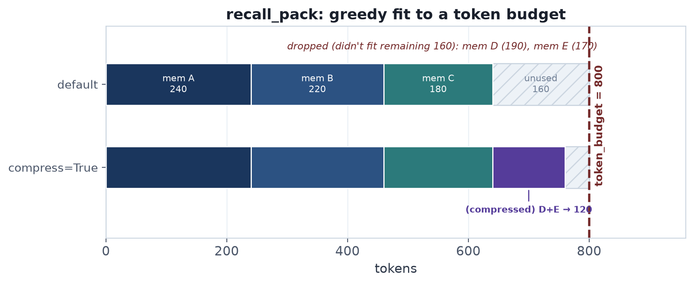

*Greedy fit to the default `token_budget = 800`: items are admitted in rank
order until the budget is exhausted; an item too large for the remaining space
is skipped while the walk continues, so a smaller lower-ranked memory can still
slot in. `compress=True` folds the dropped candidates into one `- (compressed)`
summary line when they cluster.*

#### auto_context_pack() — multi-angle fan-out

`auto_context_pack()` sits alongside `recall_pack()` for tasks with compound
concepts. It extracts up to `max_phrases` key bigram/keyword phrases from the
task (`extract_key_phrases`), runs `recall()` for the task **and** each phrase
angle independently, deduplicates by id (keeping the **best** score seen per
memory), then packs greedily through the **same** packer (`_pack_ranked`) that
`recall_pack()` uses — so `compress` works here too. It also accepts
`min_cosine` (an absolute floor applied to every fan-out query, so an
off-topic task injects nothing rather than weak padding) but deliberately
omits `fusion="rrf"`, whose pool-relative scores are not comparable across the
different fan-out pools (see §14).

---

## 6. Decay Engine

### Formula

```
score(m) = importance × exp(−λ × days_since_last_access) × reinforcement
reinforcement = 1 + frequency_weight × ln(1 + access_count)
```

| Parameter | Default | Effect |
|---|---|---|
| `decay_rate` (λ) | `0.1` | Half-life ≈ 7 days for importance=0.5 |
| `min_score` | `0.05` | Prune threshold |
| `protect_types` | `("procedural",)` | Types immune to pruning |
| `frequency_weight` | `0.0` | Recall reinforcement strength (0 = off) |

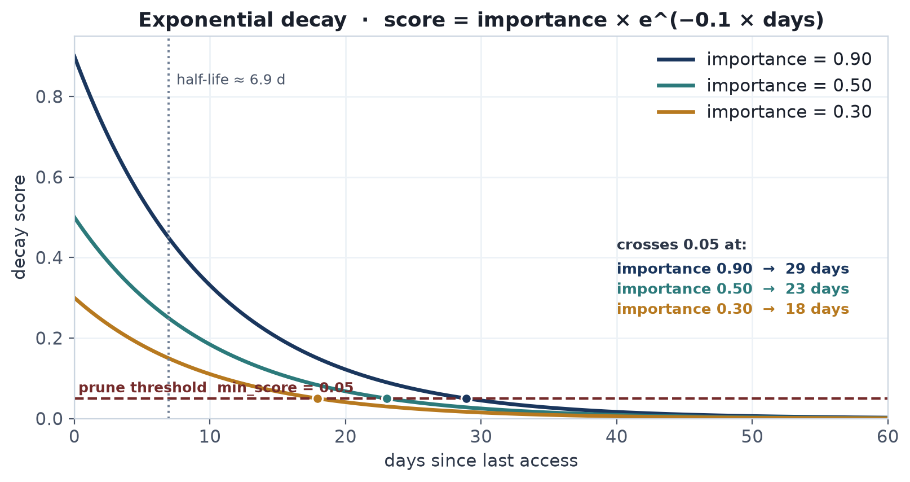

*With λ = 0.1 a memory crosses the `min_score = 0.05` prune line at ~29 days
(importance 0.90), ~23 days (0.50), or ~18 days (0.30); the dotted line marks
the ≈6.9-day half-life.*

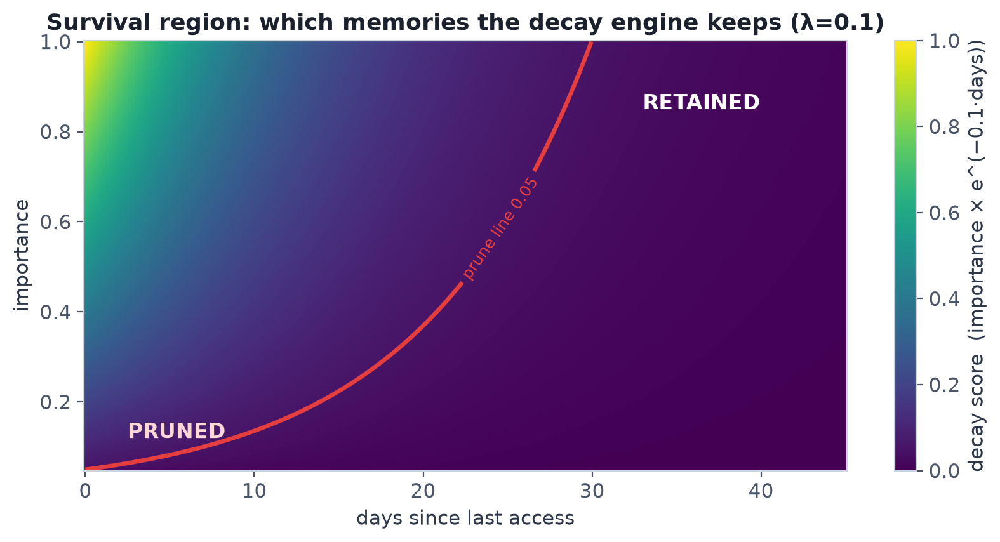

*The same score as a 2-D field — everything above the red `0.05` contour is
retained, everything below is pruned.*

### Recall reinforcement

`access_count` (incremented on every `recall()` hit) feeds back into the
score: a frequently-recalled memory ages out more slowly than an untouched
one of equal importance and age. With the default `frequency_weight = 0.0`
the reinforcement factor is exactly `1.0`, so scoring matches the
recency-only behaviour and nothing changes. As `frequency_weight` rises,
often-used memories resist pruning — e.g. `0.2` lets a memory recalled ~10
times survive a prune that drops its never-reread twin. Note the score can
then exceed `importance`; `min_score` is compared against the reinforced
value. Configurable via `[maintenance.decay].frequency_weight`,
`houkai prune --frequency-weight`, and the `MaintenanceScheduler`.

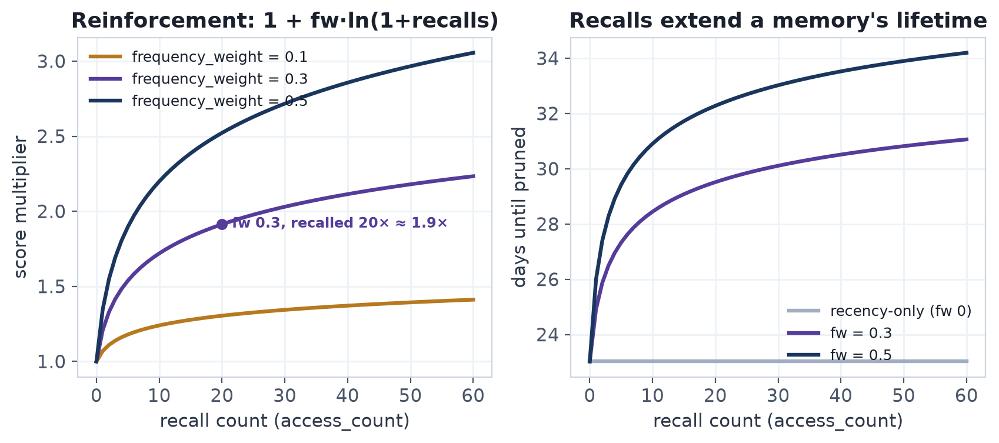

*The multiplier grows with `ln(1 + access_count)`, so each extra recall resists
decay a little less than the last; the right panel converts that into days of
added lifetime before the prune line.*

Score examples with λ=0.1 (no reinforcement, `frequency_weight=0`):

| importance | age | score | verdict |
|---|---|---|---|
| 0.9 | 1 day | 0.81 | kept |
| 0.9 | 7 days | 0.45 | kept |
| 0.9 | 30 days | 0.04 | **pruned** |
| 0.5 | 1 day | 0.45 | kept |
| 0.1 | 7 days | 0.05 | **pruned** |

### Tuning λ

| λ | Half-life (imp=0.5) | Use case |
|---|---|---|
| 0.01 | ~69 days | Long-lived knowledge bases |
| 0.05 | ~14 days | Normal agent memory |
| 0.1 | ~7 days | Fast-changing environments |
| 0.2 | ~3.5 days | Ephemeral session contexts |

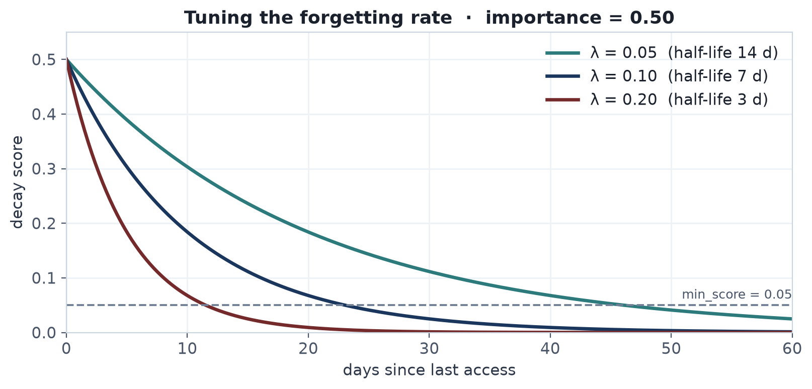

*Turning λ up steepens the forgetting curve: 0.05 → ~14-day half-life,
0.10 → ~7, 0.20 → ~3.5.*

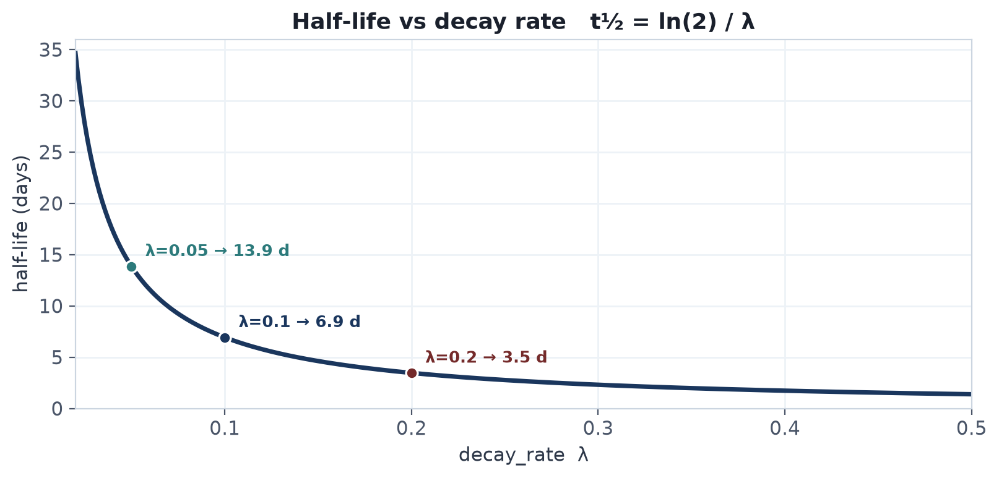

*Half-life is `ln(2)/λ`, so it falls off hyperbolically as λ rises — the three
marked points are the defaults from the table above.*

### API

```python
from ai_houkai.memory_system import MemoryStore, DecayEngine

engine = DecayEngine(store, decay_rate=0.1, min_score=0.05,
                     protect_types=("procedural",),
                     frequency_weight=0.0)   # >0 → frequent recalls resist decay

score     = engine.score(mem)            # single memory
pairs     = engine.score_all()           # all, sorted desc
candidates = engine.prune(dry_run=True)  # preview
removed    = engine.prune()              # delete stale memories
```

`now` can be overridden in both `score()` and `prune()` for
deterministic testing or time-travel simulations.

---

## 7. Reflection Engine

Implements the **Generative Agents** reflection pattern: cluster
semantically similar episodic memories and condense them into a single
semantic "summary" memory.

### Algorithm

```
1. Fetch all episodic memories from ChromaDB (with stored embeddings).
2. Sort by importance descending — highest importance seeds first.
3. Greedy single-linkage clustering:
      for each unseeded memory (highest importance first):
          start a new cluster with this memory as seed
          absorb every other unseeded memory whose cosine
          similarity to the seed ≥ similarity_threshold
4. Discard clusters with fewer than min_cluster_size members.
5. For each qualifying cluster:
      text       = summarizer(cluster_members)
      tags       = ["reflection"] + union of all source tags
      importance = mean(source importances)
      store new semantic memory  →  MemoryStore.remember()
6. If consolidate=True: delete all source episodic memories.
```

### Clustering properties

- **Seed-based**: highest-importance memory anchors each cluster.
- **Single-linkage**: a memory joins if similar to the *seed*, not all
  existing members — O(n) per seed, avoids chaining artefacts.
- **Non-overlapping**: each memory belongs to at most one cluster.

### Similarity threshold guide

| threshold | Effect |
|---|---|
| 0.95 | Only near-duplicates |
| 0.80 | Same topic, similar phrasing |
| 0.75 | Same topic, varied phrasing (default) |
| 0.60 | Broadly related content |

### Default summarizer (extractive)

```python
def _default_summarizer(memories):
    ordered = sorted(memories, key=lambda m: m.importance, reverse=True)
    body = " | ".join(m.text for m in ordered)
    return ("[Reflection ×N] " + body)[:512]
```

### LLM summarizers (`summarizers.py`)

`build_summarizer(spec)` turns a `provider:model` string into a
summarizer callable:

```python
from ai_houkai.memory_system import ReflectionEngine, build_summarizer

engine = ReflectionEngine(store, summarizer=build_summarizer("ollama:llama3.1"))
```

| Provider | Transport | Notes |
|---|---|---|
| `extractive` | — | the built-in default; also used for `None`/`""` |
| `ollama:MODEL` | stdlib `urllib` → OpenAI-compat `/v1/chat/completions` | no SDK dependency; `OLLAMA_BASE_URL` env (default `http://localhost:11434`); model may contain colons (`ollama:llama3.1:8b`) |
| `openai:MODEL` | `openai` SDK (lazy import) | raises ImportError with an `ai-houkai[openai]` hint if absent |
| `anthropic:MODEL` | `anthropic` SDK (lazy import) | `ai-houkai[claude]` hint; joins `text` content blocks |

All providers share one prompt (`render_prompt()`): events ordered by
importance, an instruction to produce a 1–3 sentence summary without
inventing facts.

**Fallback wrapper** (default on): if the LLM call raises or returns
empty/whitespace output, the extractive summarizer is used for that
cluster and a warning is logged.  This matters because reflection runs
unattended inside the maintenance daemon — a down Ollama box must not
fail the tick.  Pass `fallback=False` to surface errors instead.

Spec errors (`unknown provider`, missing model) raise `ValueError` at
build time, so a typo'd config fails fast at CLI/daemon startup — not
silently at 3 AM inside a tick.

The single config key `[maintenance.reflect].summarizer` (env override
`AI_HOUKAI_SUMMARIZER`) feeds all three consumers: `houkai reflect`
(overridable per-run with `--summarizer`), `houkai maintenance
tick/run/start`, and the MCP `maintenance_tick` tool.

### Custom summarizer

Any `Callable[[list[Memory]], str]` still works:

```python
def my_summarizer(memories):
    prompt = "\n".join(m.text for m in memories)
    return call_llm(f"Summarise these events into one insight:\n{prompt}")

engine = ReflectionEngine(store, summarizer=my_summarizer)
```

### API

```python
from ai_houkai.memory_system import MemoryStore, ReflectionEngine

engine = ReflectionEngine(store,
                          similarity_threshold=0.75,
                          min_cluster_size=2,
                          summarizer=None)

clusters = engine.clusters()              # list[list[Memory]], no writes
previews = engine.reflect(dry_run=True)   # list[Memory], not persisted
created  = engine.reflect()               # persist semantic memories
created  = engine.reflect(consolidate=True)  # + delete source episodics
```

### ChromaDB numpy array guard

ChromaDB returns embeddings as numpy arrays.  Using `raw or []` raises
`ValueError: The truth value of an array is ambiguous`.  The engine
uses an explicit `None` check:

```python
raw  = res.get("embeddings")
embs = [] if raw is None else raw   # safe for numpy arrays
```

---

## 8. MCP Server

`ai_houkai/mcp_server/server.py` uses **FastMCP** to expose seventeen tools:

**Core tools**

| Tool | Key parameters | Returns |
|---|---|---|
| `remember` | `text`, `type?`, `tags?`, `importance?`, `source?`, `on_conflict?`, `polarity?` | `{id, stored, importance}` or `{stored:false, conflicts:[…]}` |
| `edit` | `memory_id`, `text?`, `type?`, `tags?`, `importance?`, `polarity?`, `source?` | `{ok, id, text, type, tags, importance, polarity, source}` or `{ok:false, error}` — in-place, journaled, undoable |
| `recall` | `query`, `k?`, `type?`, `tag?`, `min_importance?`, `source?`, `since?`, `until?`, `mode?`, `overfetch?`, `include_superseded?` | `list[{id,text,type,tags,importance,score,created_at,superseded_by}]` |
| `recall_pack` | `query`, `token_budget?`, `type?`, `tag?`, `min_importance?`, `source?`, `since?`, `until?`, `mode?`, `max_items?`, `include_superseded?`, `compress?`, `compress_threshold?`, `compress_min_group?` | `{text, used_tokens, budget, truncated, items:[{id,text,type,tags,importance,score,tokens}], compressed_groups:[{ids,text,tokens,count}]}` |
| `auto_context` | `task`, `token_budget?`, `max_phrases?`, `mode?` | `{text, queries, used_tokens, budget, truncated, items:[{id,text,type,tags,importance,score,tokens}]}` |
| `forget` | `memory_id` | `{deleted}` |
| `list_recent` | `limit?`, `include_superseded?` | `list[{…,superseded_by}]` |
| `stats` | — | `{count, path, collection}` |

**Linking tools**

| Tool | Key parameters | Returns |
|---|---|---|
| `link`      | `src_id`, `dst_id`, `rel?` | `{ok, src_id, dst_id, rel}` |
| `unlink`    | `src_id`, `dst_id`, `rel?` | `{removed}` |
| `neighbors` | `memory_id`, `rel?`, `direction?`, `depth?` | `list[{id,text,type,tags,importance,rel}]` |

**Conflict tools**

| Tool | Key parameters | Returns |
|---|---|---|
| `find_conflicts` | `memory_id?`, `threshold?` | `list[{kind,reason,similarity,a,b}]` |
| `supersede`      | `old_id`, `new_id`         | `{ok, old_id, new_id}` |

**Maintenance & audit tools**

| Tool | Key parameters | Returns |
|---|---|---|
| `maintenance_tick` | `reflect_apply?` (omit → config `[maintenance.reflect] apply`) | `{summary, ran_decay, ran_reflect, decayed, reflected, reflect_applied, decay_error, reflect_error}` |
| `journal_tail` | `n?`, `op?`, `since_seconds?` | `list[{ts,op,actor,id,summary,meta}]` (newest first) |
| `export` | `path`, `include_vectors?`, `include_superseded?`, `type?`, `tag?`, `since?` | `{path, count, bytes, elapsed}` |
| `import` | `path`, `on_conflict?`, `regenerate_vectors?`, `dry_run?` | `{ok, imported, skipped, overwritten, renamed, errors, vectors_regenerated}` |

`maintenance_tick` honours the `[maintenance]` schedule from
`~/.config/ai_houkai/config.toml` — jobs only run when their interval has
elapsed, **including dry-run reflection** (the schedule gates the work, not
the writes), so MCP clients may call it freely (see §17). `reflect_apply`
defaults to the config's `[maintenance.reflect] apply` setting; when it
resolves to false, `reflected` is the number of summaries a real run
*would* create and `reflect_applied` is `false`.

Configuration via environment variables:

| Variable | Default |
|---|---|
| `AI_HOUKAI_PATH` | `./.chroma` |
| `AI_HOUKAI_COLLECTION` | `ai_houkai` |

The `run()` function is the **console-script entry point**:

```python
# ai_houkai/mcp_server/server.py
def run() -> None:
    mcp.run()

# pyproject.toml
[project.scripts]
ai-houkai-mcp = "ai_houkai.mcp_server.server:run"
```

### Claude Code integration

Claude Code discovers MCP servers from `~/.claude.json` (user scope) or a
project-level `.mcp.json` — **not** from `settings.json`, which has no
`mcpServers` key. The supported registration interface is
`claude mcp add --scope user|project`, and the installer prefers it.

```
Claude Code CLI
    │
    │  reads at startup / per-invocation
    ▼
~/.claude.json (user scope)  /  ./.mcp.json (project scope)
    │
    │  spawns subprocess
    ▼
ai-houkai-mcp                         (console script)
    │
    │  stdio transport (JSON-RPC 2.0)
    ▼
ai_houkai.mcp_server.server  ──►  MemoryStore  ──►  ChromaDB on disk
```

**Quickest setup** — one command:

```bash
claude mcp add ai-houkai -- ai-houkai-mcp
```

**Programmatic setup** — three equivalent paths, all backed by the same
installer module (`ai_houkai.installers.claude_code`):

```bash
# console script (installed by pip)
ai-houkai-install-claude-code --install

# python -m
python -m ai_houkai.installers.claude_code --install

# example wrapper (also offers --demo)
python examples/06_claude_code.py --install
```

**Library usage** — embed installation in your own bootstrap scripts:

```python
from ai_houkai.installers import ClaudeCodeInstaller

inst = ClaudeCodeInstaller(
    memory_path = "~/.ai_houkai",
    collection  = "my_project",          # per-project namespace
)
inst.install()                   # `claude mcp add --scope user`, or ~/.claude.json
inst.install(scope="project")    # project scope → ./.mcp.json
inst.verify()
print(inst.claudemd_snippet())
```

The installer is a small dataclass (no global state, idempotent
registration, atomic JSON-merge into existing `mcpServers`) so it composes
well with project scaffolding tooling.

#### CLAUDE.md guidance

Adding memory instructions to `CLAUDE.md` teaches Claude Code *when*
to use the tools autonomously — without the user needing to prompt:

```markdown
## Memory (AI-Houkai MCP)
- recall() before starting any task
- remember() conventions, decisions, corrections
- edit() to fix or refine an existing memory (keeps id, links, history)
- forget() outdated facts
```

Generate a full snippet: `python examples/06_claude_code.py --claudemd`

### Claude Desktop integration

```
Claude Desktop
    │
    │  reads at startup
    ▼
~/.config/claude/claude_desktop_config.json   (Linux)
~/Library/Application Support/Claude/…        (macOS)
%APPDATA%\Claude\…                             (Windows)
    │
    │  spawns subprocess
    ▼
python -m ai_houkai.mcp_server.server
    │
    │  stdio transport (JSON-RPC 2.0)
    ▼
MemoryStore ──► ChromaDB on disk
```

`examples/03_claude_desktop.py --install` locates the platform-specific
config path and patches the `mcpServers` block automatically.

---

## 9. Installers

The `ai_houkai.installers` subpackage isolates the boilerplate needed to
register the MCP server with various MCP clients.  Three installers ship
today — **Claude Code**, **Cursor**, and **OpenCode** — all built on a
shared `common.py` (command resolution, JSON load/patch/write,
`verify_server()` smoke test, and the memory-guide snippet).  The logic
used to live inside `examples/06_claude_code.py`; promoting it to a real
module means:

- Third-party tools can import the installers as a library.
- The console scripts (`ai-houkai-install-claude-code`,
  `ai-houkai-install-cursor`, `ai-houkai-install-opencode`) are available
  immediately after `pip install ai-houkai` — no example file required.
- Tests can target the installers directly without `spec_from_file_location`
  hacks for digit-prefixed examples.

### `ClaudeCodeInstaller`

```python
@dataclass
class ClaudeCodeInstaller:
    memory_path: str = "~/.ai_houkai"
    collection:  str = "claude_code"
    config_path: str = "~/.claude.json"   # direct-write fallback (user scope)
    server_name: str = "ai-houkai"
    extra_env:   dict = {}

    def build_env(self)            -> dict
    def build_mcp_block(self)      -> dict       # {"type": "stdio", ...}
    def build_settings_block(self) -> dict
    def install(self, *, scope="user") -> str    # what was written (cmd or path)
    def print_config(self)         -> None
    def verify(self)               -> bool
    @staticmethod
    def claudemd_snippet()         -> str
```

### Behaviour

- **CLI-first**: when `claude` is on PATH, `install()` shells out to
  `claude mcp remove` + `claude mcp add --scope user|project` — robust to
  future config-layout changes. Without the CLI it merges the stdio block
  into `~/.claude.json` (user) or `./.mcp.json` (project) directly.
- **Idempotent**: re-running `install()` replaces the `ai-houkai` entry
  but preserves all other servers and top-level keys.
- **Atomic writes**: direct config edits go through write-to-temp +
  `os.replace` (`common.write_json`) so a crash can never truncate the
  user's client config.
- **Unparseable config**: by default replaces a corrupted JSON file
  rather than aborting (toggle with `overwrite_unparseable=False`).
- **No import side effects**: the MCP server module creates its store
  lazily (`get_store()`, on first tool use), so importing the installers —
  or `ai_houkai.mcp_server.server` itself — never materialises a stray
  `./.chroma` or loads the embedding model. `verify()` reports the count of
  the store actually being installed (`memory_path`/`collection`), not the
  env-default one.
- **Common shape**: all installers expose the same surface
  (`build_mcp_block` / `build_settings_block` / `install` / `print_config`
  / `verify` + a client-specific guidance snippet) so callers can dispatch
  generically; future installers follow the same pattern.

### `CursorInstaller` and `OpenCodeInstaller`

Both mirror `ClaudeCodeInstaller` with client-specific defaults and
guidance snippets:

| | Cursor | OpenCode |
|---|---|---|
| Settings file | `~/.cursor/mcp.json` (`--project` → `./.cursor/mcp.json`) | `~/.config/opencode/opencode.json` (`--project` → `./opencode.json`) |
| Config schema | same `mcpServers` block as Claude | own `mcp` schema: `command` array, `environment`, `enabled`, `type: local` |
| Default collection | `cursor` | `opencode` |
| Guidance snippet | `rule_snippet()` → `.cursor/rules/*.mdc` | `agents_snippet()` → `AGENTS.md` |
| Console script | `ai-houkai-install-cursor` | `ai-houkai-install-opencode` |

### Console script wiring (`pyproject.toml`)

```toml
[project.scripts]
ai-houkai-mcp                 = "ai_houkai.mcp_server.server:run"
ai-houkai-install-claude-code = "ai_houkai.installers.claude_code:_main"
ai-houkai-install-cursor      = "ai_houkai.installers.cursor:_main"
ai-houkai-install-opencode    = "ai_houkai.installers.opencode:_main"
houkai                        = "ai_houkai.cli.main:_main"
```

---

## 10. Agent Integrations

All agent examples share the same `_dispatch_tool(name, arguments)`
interface.  Only the SDK and message format differ.

### Unified dispatch signature

```python
def _dispatch_tool(name: str, arguments: str) -> str:
    inputs: dict = json.loads(arguments)   # JSON string in, JSON string out
    if name == "remember":   ...
    elif name == "recall":   ...
    elif name == "forget":   ...
    else: return json.dumps({"error": f"unknown tool: {name}"})
```

This JSON-string interface matches the OpenAI/Ollama function-calling
format natively.  The Claude example serialises its dict input before
calling dispatch.

### Provider comparison

| | Claude (`claude_agent.py`) | OpenAI (`04_openai.py`) | Ollama (`02_ollama_local_network.py`) |
|---|---|---|---|
| SDK | `anthropic` | `openai` | `openai` (compat endpoint) |
| Tool definition | `{"name":…,"input_schema":{…}}` | `{"type":"function","function":{…}}` | same as OpenAI |
| Tool call access | `block.name`, `block.input` (dict) | `tc.function.name`, `tc.function.arguments` (str) | same as OpenAI |
| Arguments | dict → `json.dumps()` | JSON string | JSON string |
| Endpoint | `api.anthropic.com` | `api.openai.com` | `localhost:11434/v1` |
| API key required | yes | yes | no |

### Message flow (generic)

```
user message
     │
     ▼
LLM API  ──►  tool_call: {name, arguments}
     │
     ▼
_dispatch_tool(name, arguments)
     ├── "remember" ──► store.remember()  ──► {"id":…, "stored":true}
     ├── "recall"   ──► store.recall()    ──► {"results":[…]}
     └── "forget"   ──► store.forget()    ──► {"deleted":true/false}
     │
     ▼
tool result appended to messages
     │
     ▼
LLM API  ──►  assistant reply to user
```

---

## 11. Test Architecture

### 621 tests across 26 files

| File | Tests | What it covers |
|---|---|---|
| `test_maintenance.py` | 64 | Maintenance scheduler/daemon: tick, run-forever, duration parsing, state history, PID files, dry-run reflect schedule gating |
| `test_hybrid.py` | 55 | Hybrid retrieval: BM25 pool scoring, `HybridWeights`, blended ranking, link expansion, RRF fusion, MMR diversity & near-duplicate dedup, `min_cosine` gate, `explain` breakdowns, `recency_basis`, multi-hop expansion decay, CJK tokenization |
| `test_pack.py` | 52 | `recall_pack` / `auto_context_pack`: token-budget packing, truncation, custom counter, filters, rank-order preservation, near-duplicate compression, `min_cosine` |
| `test_validation.py` | 44 | Shared validation layer: store enum vocabularies, dangling-link rejection, HTTP body coercion + status codes (400/404, HEAD, non-ASCII auth), clean CLI errors |
| `test_conflicts.py` | 36 | Conflict/contradiction detection, `on_conflict` policies, supersede/restore, negation heuristic |
| `test_memory.py` | 30 | `MemoryStore`: remember, forget, nuke, recall (filters, touch control), list_recent, `Memory` dataclass serialisation |
| `test_summarizers.py` | 24 | `build_summarizer`: spec parsing, ollama/openai/anthropic providers (stubbed), extractive fallback, config + scheduler wiring |
| `test_dispatch.py` | 24 | `_dispatch_tool` for all three providers × remember / recall / forget / unknown tool |
| `test_reflection.py` | 23 | `ReflectionEngine`: clustering, reflect (dry-run, consolidate, tags, custom summarizer), skips superseded sources |
| `test_links.py` | 28 | Typed links: `link`/`unlink`/`neighbors`/`subgraph`, direction, depth, cycles, dangling targets |
| `test_ingest.py` | 22 | `chunk_text` + `houkai ingest` / `houkai collections` round-trips |
| `test_cli.py` | 22 | CLI round-trips: remember → list → show → forget → nuke, tag/bump, link/neighbors/unlink, supersede/restore, export/import, stats, prune dry-run, stdin, pack, edit re-embed, interactive conflict resolution |
| `test_edit.py` | 21 | `MemoryStore.edit()`: in-place update, re-embedding, journaling, undo, no-op detection, async wrapper, CLI edit/tag/bump, HTTP `PATCH` |
| `test_decay.py` | 20 | `DecayEngine`: score formula, score_all sorting, prune (dry-run, protect, custom now, empty store), recall reinforcement (`frequency_weight`) |
| `test_async_store.py` | 20 | `AsyncMemoryStore`: coroutine API parity with sync store, executor lifecycle, aclose |
| `test_importance.py` | 18 | `score_importance`: tier matching, modifiers, clamping, store/config wiring |
| `test_http_server.py` | 16 | HTTP/REST API: all endpoints, auth token, 404/405/400/413 error handling, concurrency lock, `/health` topology-leak guard |
| `test_stats_health.py` | 15 | `houkai stats` and `--health` report: decay histogram, at-risk/stale counts, cluster detection, decay-formula alignment with `DecayEngine` (frequency reinforcement) and protected-type exclusion |
| `test_eval.py` | 13 | Retrieval-quality metrics for `ai_houkai/eval.py`: recall/precision@k, MRR, (n)DCG, the `evaluate()` harness over a gold set |
| `test_journal.py` | 15 | Append-only audit journal: tail/show/undo, rotation, actor attribution |
| `test_export_import.py` | 13 | Portable `.ahkai` archives: export filters, import conflict policies, dry-run, vector regen |
| `test_recall_filters.py` | 12 | `source`/`since`/`until` metadata filters pushed into ChromaDB `where` clauses |
| `test_tui.py` | 10 | TUI view models, Navigator stack, Textual pilot runs (list/detail, neighbors, search) |
| `test_installers.py` | 10 | Claude Code installer: `claude mcp add` invocation, `~/.claude.json` / `.mcp.json` direct writes, config preservation, atomic `write_json`, side-effect-free import of installers and the MCP server module |
| `test_timeparse.py` | 8 | `parse_timestamp`: epoch, ISO-8601, relative spans (`7d`, `24h`), error cases |
| `test_mcp_server.py` | 6 | MCP tools in-process: lazy `get_store()` env honoring, `edit` tool result/error dicts, `maintenance_tick` config-default + explicit `reflect_apply` |

### Test isolation strategy

`EphemeralClient()` shares an in-process SQLite database.  All tests
use `PersistentClient` with a `tmp_path`-backed directory:

```python
# tests/conftest.py
@pytest.fixture()
def store(tmp_path) -> MemoryStore:
    s = MemoryStore(path=str(tmp_path / "chroma"), collection="test_memory")
    yield s
    s.client.close()      # PersistentClient leaks FDs without explicit close
```

pytest's `tmp_path` fixture creates a unique directory per test and
cleans it up afterwards.  The fixture `yield`s and then closes the
client — `PersistentClient` holds file handles open until closed, and
without teardown the OS FD limit (~1024) is exhausted after ~100 tests.

### Loading digit-prefixed modules

`importlib.import_module("04_openai")` raises `ModuleNotFoundError`.
`test_dispatch.py` uses `spec_from_file_location` instead:

```python
path = os.path.join(_EXAMPLES_DIR, filename)
spec = importlib.util.spec_from_file_location(module_name, path)
mod  = importlib.util.module_from_spec(spec)
sys.modules[module_name] = mod
spec.loader.exec_module(mod)
```

### SDK stubbing

Agent examples import `openai` and `anthropic` at module level.
Tests inject stubs before loading so no network calls happen:

```python
fake_client = types.SimpleNamespace(
    chat=types.SimpleNamespace(
        completions=types.SimpleNamespace(create=lambda **kw: None)),
    messages=types.SimpleNamespace(create=lambda **kw: None),
)
sys.modules["openai"].OpenAI = lambda **kw: fake_client
sys.modules["anthropic"].Anthropic = lambda: fake_client
```

---

## 12. Memory Linking

Typed directed edges between memories — `Link(to, rel)` stored as a
JSON string in ChromaDB metadata.

### API

```python
store.link(src_id, dst_id, rel="related")    # idempotent
store.unlink(src_id, dst_id, rel=None)       # rel=None → remove all
store.neighbors(memory_id, rel=None,
                direction="both", depth=1)   # BFS, returns [(Memory, rel)]
store.subgraph(memory_ids, depth=1)          # Graph(nodes, edges)
```

`rel` must be one of `LINK_RELS` (§3) and `dst_id` must resolve — both are
validated in the store, so a typo'd relation or a dangling target raises
instead of silently creating an edge no graph walker can follow.

Two memories may be joined by several differently-typed edges;
`neighbors()` reports one `(memory, rel)` pair per edge while still
visiting/expanding each node once. `subgraph()` tracks the best remaining
hop budget per node (not a plain visited set), so diamond shapes expand
fully — a node first reached at the depth limit is re-expanded when a
shorter path reaches it with budget to spare. `unlink()` journals the
removed rels, so undoing a rel=None unlink restores every edge it dropped.

### Supersede (soft-delete)

```python
store.supersede(old_id, new_id)   # marks old as superseded + adds "supersedes" link
store.restore(memory_id)          # undo a supersede
```

`superseded_by != ""` hides a memory from default `recall()` / `list_recent()`.
Pass `include_superseded=True` to see them.

---

## 13. Conflict / Contradiction Detection

### Detection algorithm

```
candidates(a) = recall(a.text, n=12)
for b in candidates:
    if b.type != a.type            → skip
    if sim(a,b) < threshold        → skip   (default 0.80)
    if both have tags & disjoint   → skip   (an untagged side never triggers
                                             the guard)
    if both polarities nonzero
       and opposite                → kind="contradiction", reason="polarity_diff"
    elif negation_diff(a, b)       → kind="contradiction", reason="negation_diff"
    elif contradiction_fn(a, b)    → kind="contradiction", reason="custom_fn"
    else                           → kind="duplicate",     reason="similarity"
```

`negation_diff`: strips apostrophes, tokenises, counts negation words
(`not`, `never`, `no`, `dont`, …), returns True if parity differs.

### on_conflict policies

| Policy | Effect on `remember()` |
|---|---|
| `ignore` (default) | no check |
| `warn` | `warnings.warn()` listing conflicts |
| `supersede` | auto-supersede conflicting memories |
| `raise` | raises `ConflictError(conflicts)` |

Any other value raises `ValueError` (see `CONFLICT_POLICIES`, §3) — both in
the constructor's `conflict_policy` and per-call `on_conflict`.

```python
store = MemoryStore(conflict_policy="warn", conflict_threshold=0.85)
store.find_conflicts()                       # global pairwise scan (O(n²))
store.find_conflicts(memory_id=x)            # check one memory
```

---

## 14. Hybrid Retrieval

### Score formula

```
final = α·cosine + β·BM25_local + γ·recency + δ·importance + ζ·polarity
```

| Weight | Default |
|---|---|
| α cosine          | 0.55 |
| β lexical         | 0.20 |
| γ recency         | 0.15 |
| δ importance      | 0.10 |
| ζ polarity_weight | 0.05 |

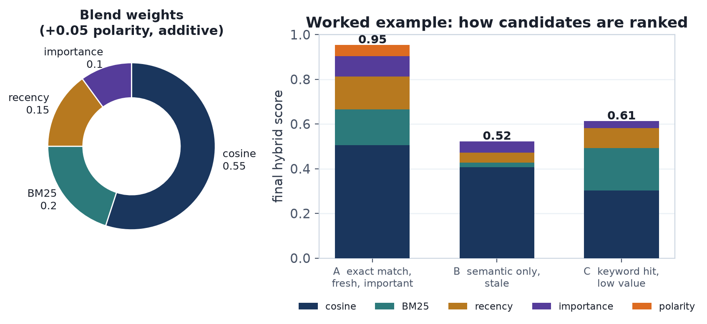

*Cosine dominates at 0.55; the worked example shows how the additive blend
ranks an exact-and-fresh hit (A, 0.95) above a strong keyword-only match
(C, 0.61) and a stale semantic paraphrase (B, 0.52).*

The polarity term is `ζ · mem.polarity` (so `+ζ` for `polarity=+1`, `−ζ`
for `−1`, nothing for neutral). It is **not** confined to hybrid mode: the
default `mode="semantic"` path also adds the same `ζ·polarity` bonus and
re-sorts its results whenever `polarity_weight ≠ 0` (with `ζ=0` the order is
the pure cosine ranking, unchanged).

`recency = exp(−λ · age_days)` — same λ as `DecayEngine` (default 0.1).
By default `age_days` is measured from `created_at`
(`HybridWeights.recency_basis="created"`), so a memory's recency score is
**stable across recalls** — it reflects how recently the fact was *learned*.
Setting `recency_basis="accessed"` measures from `last_accessed` instead,
restoring the older retrieved-recency behaviour, which is self-reinforcing
because every recall hit `_touch`-bumps `last_accessed`.

**BM25 is computed locally** over the cosine over-fetch pool only — no
second index, O(1) additional storage.

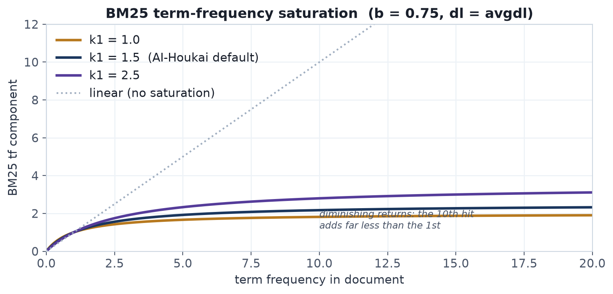

*BM25's `k1 = 1.5, b = 0.75` saturate term frequency: the 10th occurrence of a
term adds far less than the 1st, unlike a linear tf count.*

#### Fusion modes

| `fusion` | Blend |
|---|---|
| `"weighted"` (default) | the weighted sum above (`α·cosine + … + ζ·polarity`). |
| `"rrf"` | Reciprocal Rank Fusion — each signal ranks the pool independently and the fused score is `Σ weight_s / (rrf_k + rank_s)` with `rrf_k=60`; polarity stays a tiny additive nudge. |

RRF is **scale-free** (it consumes only ordinal ranks, so it is immune to
the BM25-vs-cosine magnitude mismatch), but its scores are **pool-relative**
— comparable only across identically-pooled fan-outs, not arbitrary recalls.
That is why `auto_context_pack` (which fans out over several different query
pools and dedupes by score) deliberately does **not** expose `fusion="rrf"`.

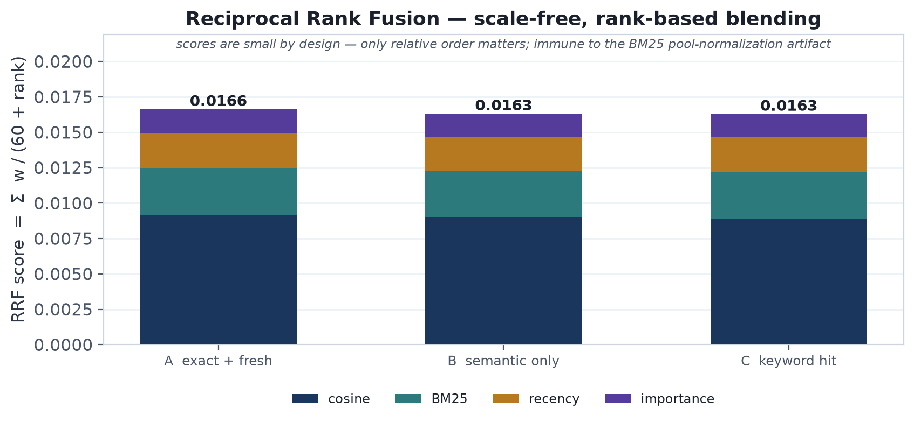

*RRF sums `weight / (60 + rank)` across signals. Scores are tiny by design —
only the relative order matters — which is exactly what makes it immune to the
BM25-vs-cosine magnitude mismatch the weighted blend has to normalise around.*

#### Re-selection, dedup, and gating

- `diversity` (0..1) re-selects results with Maximal Marginal Relevance
  (`_mmr_select`): `score = λ·relevance − (1−λ)·max_cosine_to_selected`,
  higher → more relevance, lower → more novelty. Relevance is min-max
  normalised to [0,1] so the trade-off is on the same scale as the cosine
  novelty penalty (critical for the tiny RRF scores).
- `dedup_threshold` hard-drops a candidate whose cosine to an
  already-selected result is ≥ the threshold (e.g. `0.92`).
- `min_cosine` is an **absolute** cosine floor; candidates below it are
  dropped so a caller can receive *nothing* rather than weak hits. Out of
  the `[-1, 1]` range → `ValueError` (as do out-of-range `diversity` /
  `dedup_threshold`).
- `touch=False` makes recall read-only (no access-count / `last_accessed`
  bump) — e.g. for evaluation.
- `explain=True` returns `(Memory, score, breakdown)` triples.
- `diversity` / `dedup_threshold` also apply in `mode="semantic"`.

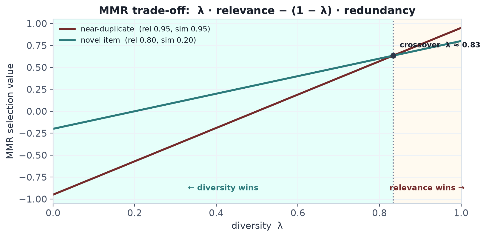

*MMR's `λ · relevance − (1 − λ) · redundancy`: below the crossover λ a novel,
slightly-less-relevant item beats a near-duplicate of something already
selected; above it, raw relevance wins.*

#### Lexical renormalisation

When a query yields **zero** BM25 across the whole pool (e.g. an
all-stopword or out-of-vocabulary query), the lexical weight is dropped and
the remaining core weights (`cosine`, `recency`, `importance`) are
renormalised so scores are not artificially depressed — unless the config is
lexical-only (nothing to scale the weight into), in which case the weights
are left untouched.

#### CJK / Korean tokenization

`_tokenize` emits character **bigrams** for non-Latin runs (Hiragana,
Katakana, CJK ideographs, and Hangul), so BM25 and the Jaccard similarity
used elsewhere still produce a lexical signal for CJK/Korean text that has no
whitespace word boundaries.

### API

```python
store.recall(query, k, mode="hybrid")                    # default weights
store.recall(query, k, mode="hybrid",
             weights=HybridWeights(cosine=0.8, lexical=0.1,
                                   recency=0.05, importance=0.05))
store.recall(query, k, overfetch=6)                      # larger cosine pool

# Ranking controls
store.recall(query, k, fusion="rrf")                     # Reciprocal Rank Fusion
store.recall(query, k, diversity=0.7, dedup_threshold=0.92)  # MMR + near-dup drop
store.recall(query, k, min_cosine=0.2)                   # absolute relevance gate
store.recall(query, k, touch=False, explain=True)        # read-only + breakdowns

# Graph-walk expansion after scoring (multi-hop BFS)
store.recall(query, k,
             expand=ExpandSpec(rels=("refines","example_of"),
                               depth=2, cap=5, score=0.70, decay=0.8))
#   hop-h neighbour scored score·decay**(h-1); decay=1.0 (default) = old
#   distance-independent behaviour; depth>1 now does a real BFS over links.

# Metadata filters — provenance + creation-time window
store.recall(query, k, source="git", since=ts_a, until=ts_b)
```

Default `mode="semantic"` is unchanged — zero risk for existing callers.

The `explain=True` breakdown shape **varies by scoring path**:

| Path | Breakdown keys |
|---|---|
| weighted hybrid | `cosine`, `lexical`, `recency`, `importance`, `polarity`, `weights`, `score` |
| `fusion="rrf"`  | `signals` (per-signal `{rank, contribution}`), `polarity`, `rrf_k`, `score` |
| semantic        | `cosine`, `polarity`, `score` |
| graph-expanded  | `{source:"graph_expansion", rel, hop, score}` |

#### Metadata filters

`recall` (and `recall_pack`) accept `source`, `since` and `until` alongside
the existing `type` / `tag` / `min_importance`. `source` matches the exact
provenance string set at `remember` time; `since`/`until` are Unix timestamps
bounding `created_at` (inclusive). `type`, `min_importance`, `source`, `since`
and `until` push down into Chroma's `where` clause; `tag` is still matched
post-query against the comma-joined tag list.

ChromaDB ≥ 1.x rejects a multi-key `where` (`{"a":1,"b":2}`) and a
multi-operator leaf (`{"created_at":{"$gte":x,"$lte":y}}`) — each leaf must
carry exactly one operator, with conjunctions expressed via an explicit
`$and`. `store._build_where()` centralises this: it returns `None` for no
filters, a flat single-condition clause for one, and an `$and` of
single-operator leaves otherwise (the `since`/`until` range becoming two
separate `created_at` leaves). This also fixed a latent bug where combining
`type` with `min_importance` previously emitted a rejected two-key clause.

The user-facing layers parse human time inputs through
`ai_houkai/timeparse.py::parse_timestamp`, which accepts epoch seconds, an
ISO-8601 date/datetime (naive values read as UTC, trailing `Z` honoured), or a
relative span like `"7d"` / `"24h"` (→ now minus that span).

---

## 15. Extension Points

> The designs in [PROPOSALS.md](https://raw.githubusercontent.com/nexusriot/AI-Houkai/main/) are now implemented (§12–14).
> Hybrid retrieval scoring is built in (§14, `mode="hybrid"`), and scheduled
> maintenance shipped as the `ai_houkai.maintenance` subsystem (§17) — no
> hand-rolled threads needed.  The sketches below remain valid as quick
> recipes for further customisation.

### Multi-user / multi-agent

Each `MemoryStore` targets a single collection.  Isolate agents by
passing distinct collection names:

```python
from ai_houkai.memory_system import MemoryStore

alice = MemoryStore(path=".chroma", collection="agent_alice")
bob   = MemoryStore(path=".chroma", collection="agent_bob")
```

### Pluggable embeddings

```python
from chromadb.utils.embedding_functions import OpenAIEmbeddingFunction

store.collection = store.client.get_or_create_collection(
    name="ai_houkai",
    embedding_function=OpenAIEmbeddingFunction(
        api_key=os.environ["OPENAI_API_KEY"],
        model_name="text-embedding-3-small",
    ),
    metadata={"hnsw:space": "cosine"},
)
```

### LLM reflection summarizer

Built in — see §7 (`build_summarizer("ollama:llama3.1")` /
`openai:…` / `anthropic:…`, configured via
`[maintenance.reflect].summarizer`).  For anything beyond the three
providers, pass any callable:

```python
from ai_houkai.memory_system import ReflectionEngine

def my_summarizer(memories):
    prompt = "\n".join(f"- {m.text}" for m in memories)
    return call_llm(f"Distil these events into one insight:\n{prompt}")

engine = ReflectionEngine(store, summarizer=my_summarizer)
```

### Importance auto-assignment

Built in — `ai_houkai/memory_system/importance.py` implements the tiers
below as a deterministic regex heuristic (`score_importance(text, type,
tags)`), wired via `MemoryStore(importance_fn=…)`, the CLI
(`--auto-importance` or `default_importance = "auto"`), and the MCP
server (`AI_HOUKAI_AUTO_IMPORTANCE=1`):

- **High** (0.9): explicit user instructions, corrections, preferences
- **Medium-high** (0.75): decisions, conventions, policies
- **Medium** (0.6): task completions, durable project facts
- **Low** (0.35): hedged/passing observations
- Modifiers: +0.10 procedural/feedback, −0.15 questions, −0.10 fragments

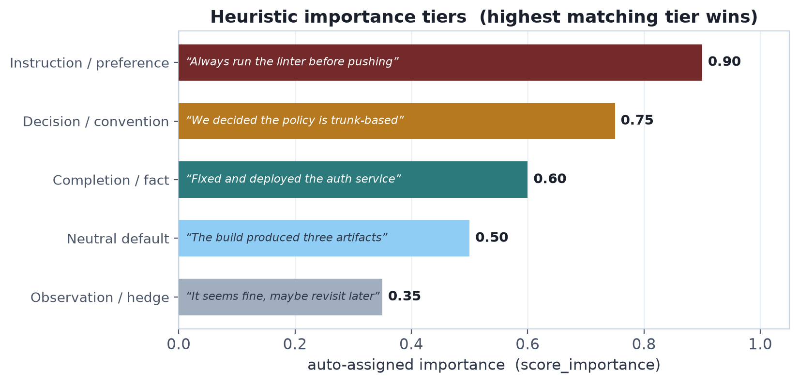

*Each bar is the score the shipped `score_importance()` actually returns for
the quoted phrase; the highest matching tier wins.*

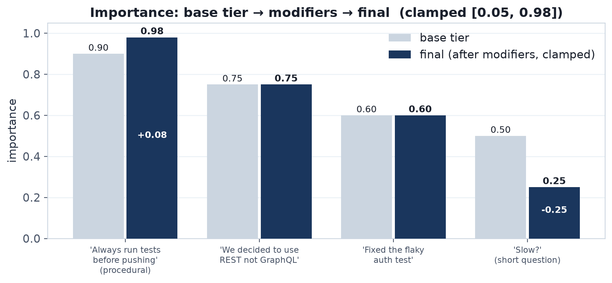

*Base tier → modifiers → final, clamped to `[0.05, 0.98]`. A procedural
instruction saturates at the 0.98 ceiling (0.90 tier + 0.10 type bonus), while
the short question "Slow?" drops to 0.25 (−0.15 question, −0.10 fragment).*

Still open as an extension: **LLM-based** scoring (ask the model to rate
0–1 before storing) — pass any callable as `importance_fn`.

---

## 16. CLI — houkai

The `houkai` command gives a human operator direct terminal access to
the same `MemoryStore` that agents and MCP clients use.  It is an
optional dependency (`pip install "ai-houkai[cli]"`) so the core memory
library stays dep-light.

### Dependency strategy

```toml
# pyproject.toml
[project.optional-dependencies]
cli = ["typer>=0.12", "rich>=13.7"]

[project.scripts]
houkai = "ai_houkai.cli.main:_main"
```

`typer` and `rich` are not imported at the module level of any
`memory_system` or `mcp_server` code — the CLI subtree is the only
consumer.  A `try/except ImportError` guard at the entrypoint prints a
friendly install hint if the extras are absent.

### Architecture

```
houkai (bin)
  └── ai_houkai/cli/main.py          Typer app; registers 27 commands plus
                                     three sub-command groups (maintenance,
                                     journal, collections); shared
                                     --store / --collection flags
        ├── config.py                Config resolution chain:
        │                             1. --store / --collection CLI flags
        │                             2. AI_HOUKAI_PATH / AI_HOUKAI_COLLECTION env
        │                             3. ~/.config/ai_houkai/config.toml
        │                             4. ~/.ai_houkai/.chroma  /  ai_houkai
        ├── output.py                Output layer:
        │                             - rich Table (TTY)
        │                             - TSV (non-TTY / pipe)
        │                             - JSON (--format json)
        │                             - id prefix resolution (8-char → UUID)
        │                             - fmt_age(), fmt_importance() helpers
        └── commands/
              *.py                   One module per logical group;
                                     each file exports plain functions
                                     registered in main.py via
                                     app.command("name")(fn)
```

All command functions take `ctx: typer.Context` as their first
parameter.  The shared callback stores `{"store": MemoryStore, "config":
Config}` in `ctx.obj` before any subcommand runs.

### Command inventory

| Command | Module | Wraps |
|---|---|---|
| `remember` | `remember.py` | `store.remember()` |
| `recall` | `recall.py` | `store.recall()` |
| `pack` | `pack.py` | `store.recall_pack()` |
| `list` | `list_cmd.py` | `store.list_recent()` + Python filters |
| `show` | `show.py` | `store._get_by_id()` |
| `forget` | `forget.py` | `store.forget()` |
| `nuke` | `nuke.py` | `store.nuke()` — deletes all memories; confirms unless `--yes` |
| `edit` | `edit.py` | `store.edit()` in place (re-embeds when text changed; id + links preserved; journaled + undoable) |
| `tag` | `edit.py` | `store.edit(tags=…)` — journaled + undoable |
| `bump` | `edit.py` | `store.edit(importance=…)` — journaled + undoable |
| `link` | `link.py` | `store.link()` |
| `unlink` | `link.py` | `store.unlink()` |
| `neighbors` | `link.py` | `store.neighbors()` |
| `graph` | `link.py` | `store.subgraph()` |
| `conflicts` | `conflicts.py` | `store.find_conflicts()` |
| `supersede` | `conflicts.py` | `store.supersede()` |
| `restore` | `conflicts.py` | `store.restore()` |
| `prune` | `decay.py` | `DecayEngine.prune()` |
| `reflect` | `reflect.py` | `ReflectionEngine.reflect()` |
| `export` | `io.py` | `store.list_recent()` → JSONL |
| `import` | `io.py` | JSONL → `store.remember()` |
| `info` | `io.py` | inspect a `.ahkai` archive without importing |
| `backup` | `io.py` | `shutil.copytree(.chroma → backups/<ts>/)` |
| `stats` | `stats.py` | `store.list_recent()` + Counter; `--health` reuses the engine decay formula (incl. frequency reinforcement) with `decay_rate` / `min_score` / `protect_types` / `frequency_weight` loaded from `[maintenance.decay]` config (overridable via `--decay-rate` / `--frequency-weight`) so its at-risk count matches `prune()` |
| `ingest` | `ingest.py` | `chunk_text()` → one `store.remember()` per chunk |
| `serve` | `serve.py` | `http_server.serve()` — starts JSON HTTP API on `--host`/`--port`, optional `--token` |
| `tui` | `tui_cmd.py` | `HoukaiTui` (Textual; needs the `tui` extra) |
| `maintenance` (group) | `maintenance.py` | `MaintenanceScheduler` — tick/run/start/stop/status |
| `journal` (group) | `journal.py` | `Journal` — tail/show/undo |
| `collections` (group) | `collections.py` | Chroma client — list/create/delete/copy (embeddings copied verbatim) |

### Output system

`output.py` selects the renderer at call time (not import time) by
checking `sys.stdout.isatty()` and `NO_COLOR`:

```
stdout isatty + no NO_COLOR  →  rich Table  (colour, box-drawing)
stdout not a TTY              →  TSV         (tab-separated, machine-readable)
--format json                 →  JSON array  (explicit override)
```

Every table row uses an 8-char id prefix.  Full UUIDs are accepted on
input; `resolve_id_prefix()` performs a linear scan of all memories and
raises `ValueError` on ambiguous or missing prefixes.

### Safety rules

- **Destructive commands** (`forget`, `nuke`, `prune --apply`, `reflect --apply
  --consolidate hard`, `import`) confirm interactively unless `--yes`.
- `nuke` deletes **all** memories in the active collection in one call;
  it shows the count before prompting, and returns the number deleted.
- `prune` and `reflect` default to **dry-run** — matching the underlying
  engine conventions — and require an explicit `--apply` flag to write.
- `tag` and `bump` update only metadata (via `store.edit()`); the embedding
  vector is unchanged, keeping the semantic index consistent.
- `edit` updates the record in place via `store.edit()`, keeping the same
  id and all links; the text is re-embedded only when it changed. All three
  curation commands are journaled (op `edit`) and reversible with
  `houkai journal undo`.
- **Clean errors**: store validation failures (bad enum value, unknown id,
  self-link, supersede cycle) surface as a one-line `Error: …` + exit 1 via
  `output.friendly_errors()`, never a traceback. `remember --on-conflict
  raise` hitting a real conflict prints the conflicts and exits — the
  policy outcome, not a crash.

### Config file

`~/.config/ai_houkai/config.toml` (read with `tomllib`, stdlib ≥ 3.11):

```toml
store_path         = "~/.ai_houkai/.chroma"
collection         = "ai_houkai"
default_type       = "semantic"
default_importance = 0.5
editor             = "nvim"    # fallback: $EDITOR env, then "nano"
```

### Testing strategy

`tests/test_cli.py` uses Typer's `CliRunner` — no subprocess, no disk
I/O outside `tmp_path`.  Each test creates a fresh isolated store via
`--store tmp_path/chroma --collection cli_test`.

HF Hub model load warnings are emitted to stdout through the runner;
UUID extraction uses a regex (`_first_uuid()`) rather than assuming the
output is only the UUID, making tests robust to logging noise.

---

## 17. Scheduled Maintenance

Decay and reflection only matter if they run regularly.  The
`ai_houkai.maintenance` subpackage orchestrates both on a schedule
without any external dependency (no APScheduler, no celery).

### Components

```
maintenance/
├── durations.py   parse_duration("24h") → seconds; format_duration() back
├── state.py       MaintenanceState — JSON file with last-run timestamps
│                  and bounded run history; next_run_at() schedule math
├── scheduler.py   MaintenanceScheduler — tick() + run_forever(stop_event)
│                  TickResult — per-job ran/count/error + summary()
└── daemon.py      PID-file helpers (get/write/remove/is_alive/stop)
                   + spawn_detached() for `houkai maintenance start`
```

### Tick semantics

`tick()` is the single unit of work and is **idempotent with respect to
the schedule**: each job (decay, reflect) runs only if its configured
interval (`decay_every`, default 24 h; `reflect_every`, default 7 d) has
elapsed since the last run recorded in `MaintenanceState`.
Callers may therefore invoke it as often as they like — from cron, from
the foreground loop (`tick_interval`, default 5 min), from an MCP client
via the `maintenance_tick` tool, or ad hoc.

**Concurrent tickers serialise.** The whole load→run→save cycle holds an
exclusive `flock` on `<state file>.lock`, so the daemon loop, a cron tick,
and the MCP tool can share one state file without double-running a job or
clobbering each other's timestamps: a blocked ticker waits, re-loads the
fresh state, and sees the job as no longer due. (On non-POSIX platforms
without `fcntl`, ticks run unlocked as before.)

**The schedule gates the work, not the writes.** A reflection run stamps
`last_reflect_at` even in dry-run mode: clustering is O(n²) and the
summarizer may call an LLM, and both costs are paid on a dry-run too.
(Before this rule, a dry-run-configured caller re-ran full reflection —
LLM call included — on *every* tick, forever.) `TickResult.reflect_applied`
records which mode ran, and `summary()` says `reflect would create N
(dry-run)` vs `reflect created N`. Totals (`total_reflected`) only count
persisted summaries.

Errors in one job never block the other; they are captured in
`TickResult.decay_error` / `reflect_error` and surfaced in `summary()`.
A failed job does **not** advance its schedule — it retries next tick.

### Three deployment modes

| Mode | Command | Mechanism |
|---|---|---|
| cron one-shot | `houkai maintenance tick` | synchronous tick, exit |
| foreground loop | `houkai maintenance run` | `run_forever()` until SIGINT/SIGTERM |
| background daemon | `houkai maintenance start/status/stop` | `spawn_detached()` + PID file, logs to `~/.ai_houkai/maintenance.log` |

Configuration lives in the `[maintenance]` section of
`~/.config/ai_houkai/config.toml` (see README for the full key list);
`reflect.apply` defaults to **false** so reflection observes without
writing until explicitly enabled, and `reflect.summarizer` selects an
LLM summarizer spec (§7) for the daemon's reflection runs.

---

## 18. Audit Journal

Every mutation of the store is appended to a JSONL journal
(`journal.log` next to the Chroma directory) by
`ai_houkai/memory_system/journal.py`.

### Entry format

One compact JSON object per line:

```json
{"ts": 1748284800.123, "op": "supersede", "actor": "reflection",
 "id": "72be7903-…", "before": {…}, "after": {…}, "meta": {"new_id": "…"}}
```

- **op** — `remember | forget | edit | supersede | restore | link | unlink |
  reflect | decay | import | export | undo`
- **actor** — who performed it: `cli` / `mcp` / `http` / `reflection` /
  `decay` / `import` / `lib`
- **before / after** — full memory snapshots where applicable; these are
  what make `undo` possible.

### Design properties

- **Best-effort writes** — a journal failure is logged, never raised; the
  memory operation itself always wins.
- **Crash-safe appends** — `O_APPEND` line writes are atomic on POSIX
  (≤ PIPE_BUF); `read()` skips a truncated trailing line.
- **Size-based rotation** — file size is checked every 256 appends;
  beyond `rotate_mb` (64 MB) the log is gzipped to a timestamped archive,
  and archives older than `keep_days` (90) are pruned.

### Undo

`MemoryStore.undo(entry)` reverses a single entry where possible
(`remember` → forget, `forget` → re-add from the `before` snapshot,
`edit` → restore the `before` snapshot (re-embedding the text),
`supersede`/`restore`/`link`/`unlink` → inverse op).  It refuses rather
than clobbers: e.g. undoing a `forget` fails if the id already exists
again, and undoing an `edit` or `unlink` fails if the memory (or a link
endpoint) has since been forgotten.  Every successful undo is itself
journalled with `op="undo"`.

---

## 19. Portable Import / Export

`MemoryStore.export()` / `import_()` move memories between stores via
the **`.ahkai`** format: gzipped JSONL with a header object on line 1
(format name, version, source store/collection, embedding model,
options) followed by one memory per line.

### Export

- Streams in `created_at` ascending order, so two exports of the same
  store are byte-identical modulo the header timestamp.
- Embeddings are included by default (`include_vectors=True`) so the
  importing side can skip re-running the model; `--no-vectors` shrinks
  the file when portability matters more than speed.
- Filterable by `types`, `tags`, `since`, `include_superseded`.

### Import

- **Conflict policies** on id collision: `skip` (default) ·
  `overwrite` · `rename` (new UUID) · `error`.
- **Model safety**: if the archive's embedding model differs from the
  importing store's, the import raises unless
  `regenerate_vectors=True`, which re-embeds text on the way in.
- **dry_run** previews counts without writing; all real imports are
  journalled with `actor="import"`.

`houkai info dump.ahkai` prints the header without touching the store,
and `houkai backup` snapshots the raw Chroma directory for
disaster recovery (orthogonal to `.ahkai`, which is portable data).

---

## 20. HTTP / REST API

`ai_houkai/http_server/` exposes the same `MemoryStore` over a small JSON
HTTP API, for clients that cannot speak MCP — web apps, shell scripts,
automation tools, non-MCP agents. It is **standard-library only**
(`http.server.ThreadingHTTPServer`), so it adds no dependency beyond the
core memory layer, mirroring the project's lean-deps stance (cf. the stdlib
`urllib` Ollama summarizer in §7).

### Surface

| Method & path | Store call |
|---|---|
| `GET /health` | `count()` — always reachable (liveness, skips auth); returns only `{status, count}`, omitting the collection name |
| `GET /stats` | path / collection / count |
| `GET /memories` | `list_recent(limit, include_superseded)` |
| `POST /memories` | `remember(...)` → 201, or 409 on `ConflictError` |
| `GET /memories/{id}` | `_get_by_id` → 404 if absent |
| `PATCH /memories/{id}` | `edit(...)` — in-place, journaled; 404 if absent, 400 on bad field |
| `DELETE /memories/{id}` | `forget` → 404 if absent |
| `GET /memories/{id}/neighbors` | `neighbors(rel, direction, depth)` |
| `GET\|POST /recall` | `recall(...)` incl. `source`/`since`/`until` |
| `POST /recall_pack` | `recall_pack(...)` |
| `POST /links` · `POST /unlink` | `link` / `unlink` |
| `POST /supersede` · `POST /conflicts` | `supersede` / `find_conflicts` |

The newer ranking and compression knobs (`fusion`, `diversity`,
`dedup_threshold`, `min_cosine`, `expand`, and `recall_pack`'s `compress*`
group) are **not** exposed over HTTP — `/recall` and `/recall_pack` accept
only the stable parameter set (`query`, `k` / `token_budget`, `type`, `tag`,
`min_importance`, `source`, `since`, `until`, `mode`, `max_items`,
`include_superseded`). Callers needing the full ranking surface use the
Python API or MCP.

### Design

- **Framework-free routing.** A single `_ROUTES` table of
  `(method, compiled_regex, handler, needs_body)` rows. Each handler is a
  plain function `(store, match, query, body) -> (status, payload)`. One
  `_dispatch` method serves every verb (`do_GET = do_POST = … = _dispatch`).
  `HEAD` is dispatched as `GET` with the response body suppressed, so
  `HEAD /health` liveness probes work. A path that matches a row but not
  the verb returns `405`; no match is `404`.
- **Input coercion.** Query-string params go through `_as_int` / `_as_float`
  / `_as_bool`; JSON-body params go through the matching `_body_int` /
  `_body_float` / `_body_bool` twins, which accept JSON-native types and
  numeric strings and raise `HttpError(400)` on anything else (a JSON
  `"false"` is falsy, `null` falls back to the default). Store-level
  validation errors (bad `mode` / `type` / `rel` / `polarity` /
  `on_conflict`, self-link, supersede cycle) surface as
  `400 {"error": "<message naming the allowed values>"}`; unknown ids are
  `404`.
- **Errors.** Handlers raise `HttpError(status, message)` for expected
  failures (400 bad input, 404 missing, 413 oversized body); any other
  exception is caught and rendered as
  `500 {"error": "internal server error", "request_id": "<hex>"}` so a single
  bad request never takes the server down. The exception type, message, and
  traceback are deliberately **not** leaked to the client — only the
  `request_id` is, so a failure can be correlated to a server-side log.
  Request bodies are capped at 4 MiB and parsed as a JSON object.
- **Auth.** Optional bearer token (`auth_token` arg / `AI_HOUKAI_HTTP_TOKEN`).
  When set, every route except `/health` requires
  `Authorization: Bearer <token>`, compared with `hmac.compare_digest` over
  UTF-8 **bytes** (constant-time, so a wrong token can't be recovered by
  timing; the str overload would raise on a non-ASCII header and kill the
  request thread instead of returning 401). Binds `127.0.0.1` by default;
  exposing `0.0.0.0` is left to a deliberate `--host` / env override behind a
  trusted network or reverse proxy.
- **Attribution.** The server sets the store's actor to `"http"`, so journal
  entries from API writes are distinguishable from `cli` / `mcp` / `lib`.

### Entry points

- `houkai serve [--host --port --token]` — reuses the CLI-selected store.
- `ai-houkai-serve` console script → `http_server.server:run`, configured
  purely by env (`AI_HOUKAI_PATH`, `AI_HOUKAI_COLLECTION`,
  `AI_HOUKAI_HTTP_HOST`, `AI_HOUKAI_HTTP_PORT`, `AI_HOUKAI_HTTP_TOKEN`) so it
  needs no CLI extras — symmetric with `ai-houkai-mcp`.
- `make_server(...)` / `serve(...)` / `build_handler(...)` for embedding the
  API in another process or test (tests drive a real server on port 0).
